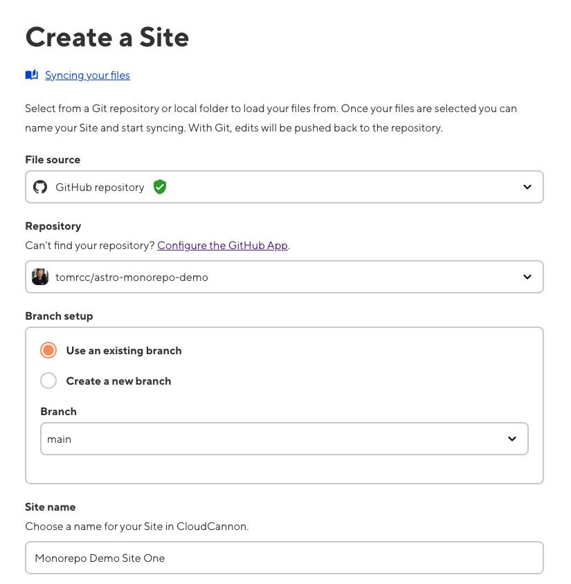
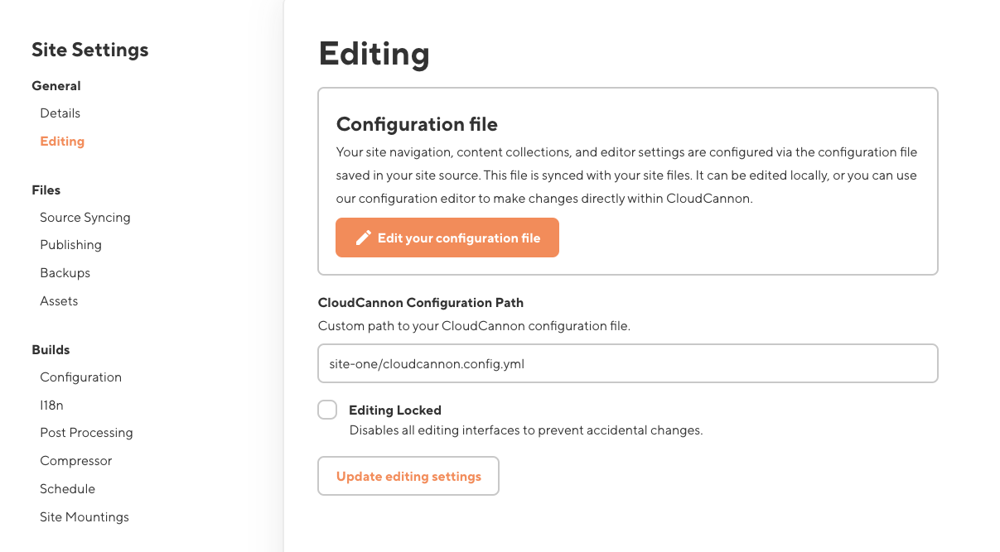
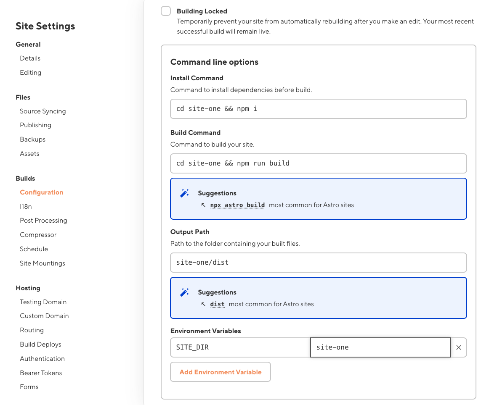

# Astro CloudCannon Monorepo Demo

Demonstrating how to set up a monorepo of two Astro sites in CloudCannon.

*This guide is for sites using [unified config](https://cloudcannon.com/documentation/guides/unified-configuration-migration-guide/) in CloudCannon.*

1. Add your individual sites to one repository, each nested under their own directory

2. Add a .cloudcannon directory to the root of the repository, containing a file called `postbuild`

3. The postbuild should look like:

  ```
  #!/usr/bin/env bash

  echo "Running in the root of the monorepo"
  cd $SITE_DIR
  echo "cd into $SITE_DIR"
  npm i
  npx @bookshop/generate
  ```

  `$SITE_DIR` we will set up as an environment variable on each site, so that we run our postbuild script in the correct directory

4. Add a `cloudcannon.config.yml` in the root of the directory containing each site. Although CloudCannon expects the `cloudcannon.config.yml` in the root of the repository by default, and we’re nesting each site’s in its own directory, we’ll set the configuration path in our site settings in CloudCannon later to tell CloudCannon where to find each site’s CC config file.

5. In your `cloudcannon.config.yml` add the `source:` key with the directory of your site as the value, eg. `source: site-one` . This means all your paths can be relative to the root of your site (nested in a directory) rather than to the root of your repo. 

  **NOTE**: An exception to this is schema paths in your collections configuration, which are relative to the root of your *repo*, not the site, eg. 

  ```yaml
      schemas:
        default:
          name: New Page
          path: site-one/schemas/page.md
  ```

  (Assuming your schemas are nested in the root of your sites)

6. Once both your sites are set up following the steps above, create both your sites individually on CloudCannon.

7. To create a site, navigate to your CloudCannon organisation, go to Sites in the left sidebar, and click ‘Create a Site’

  

8. Find your repository, and give your site a name.

9. Once your site has built, you should see a screen prompting you to make a `cloudcannon.config.yml` file. CloudCannon has detected there is no config file at the root of your repository. Ignore this prompt, and go to your site settings in the bottom of your sidebar.

10. Under **General** > **Editing**, go to **CloudCannon Configuration Path** and add the path to individual site’s CloudCannon config file - replacing `site-one` with the directory name that your site is nested in. If CloudCannon has tried to create a configuration file for you (since it didn't detect one in the root), make sure to discard this file, by clicking save, and discarding the file in the save pop up modal.

  

11. Under **Builds** > **Configuration**, go to **Command line options** and **Environment Variables** and fill in like below, replacing `site-one` with the name of site. Make sure to uncheck **Building Locked.**

  

12. Repeat steps 7-11 for your other site(s), replacing site-one with the directory name each site is stored under in your repository.

## Sites Not Using Unified Config

*For legacy sites not using [unified config](https://cloudcannon.com/documentation/guides/unified-configuration-migration-guide/) in CloudCannon.*

The following build config must be added to make each site work in `Site Settings > Builds > Configuration`.

### Site One Build Config

#### Command Line Options

Install Command: `cd site-one && npm install`

Build Command: `cd site-one && npm run build`

Output Path: `site-one/dist`

#### Environment Variables

`CLOUDCANNON_CONFIG_PATH=site-one/cloudcannon.config.yml`

`SITE_DIR=site-one`

### Site Two Build Config

#### Command Line Options

Install Command: `cd site-two && npm install`

Build Command: `cd site-two && npm run build`

Output Path: `site-two/dist`

### Configuration File

In your `cloudcannon.config.yml` add the `source:` key with the directory of your site as the value, eg. `source: site-one` . This means all your paths can be relative to the root of your site (nested in a directory) rather than to the root of your repo. NOTE: An exception to this is schema paths in your collections configuration, which are relative to the root of your *repo*, not the site, eg. 

```yaml
    schemas:
      default:
        name: New Page
        path: site-one/schemas/page.md
```

(Assuming your schemas are nested in the root of your sites)